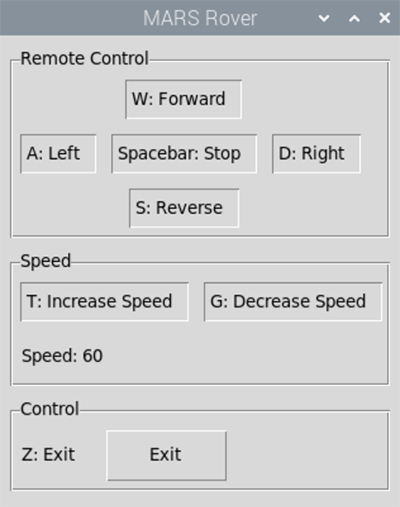

# M.A.R.S. Rover

The 4tronix MARS Rover is loosely based on the Curiosity and other Mars 2020 rovers from NASA. It uses the same rocker arm, bogey, and differential arm mechanisms.

- I purchased the Raspberry Pi Zero version of the MARS Rover. I used a Raspberry Pi Zero 2 W as the Pi Zero doesn't have enough horse power to process and stream video.
- https://shop.4tronix.co.uk/products/marsrover 

## Code

- rover_gui.py: Python Tkinter remote control program
- rover_gui_sonar.py: Python Tkinter remote control program with ultrasonic sensor ranging
- video_stream_tkinter.py: Tkinter app that uses opencv-python for video streaming

## 4tronix Rover Libraries

- rover.py: Rover library from 4tronix - must be in the program folder
- pca9685.py: Rover library from 4tronix - must be in the program folder

## Changes

- 08/01/2023: Used opencv-python for video streaming in a Tkinter app. It takes less overhead than streaming from a web server on the pi over the network. The video stream stays local. The only network traffic is the RealVNC traffic.
- 01/01/2021: The robot was designed for a Raspberry Pi Zero W. I put in a Raspberry Pi Zero 2 W. I wanted the extra horsepower of the Zero 2. The Zero 2 takes more amperage than the 4 onboard AA rechargeble batteries can put out. I connected a small phone charger battery directly to the Pi.

## Purpose

I am an Information Technology Instructor at Western Nebraska Community College. I teach Information Technology, CyberSecurity and Computer Science.
Who can ever have enough robots? Who doesn't want to drive their own MARS Rover?

This repository is for my personal projects with the M.A.R.S. Rover.

- Facebook: [Facebook WNCC IT Program](https://www.facebook.com/wnccitprogram/)
- YouTube: [YouTube WINCC IT Program](https://www.youtube.com/@williamloringitinstructor)

### License

 This work is licensed under a <a rel="license" href="http://creativecommons.org/licenses/by-nc-sa/4.0/">Creative Commons Attribution-NonCommercial-ShareAlike 4.0 International License</a>.

Copyright (c) 2024 William A Loring
  